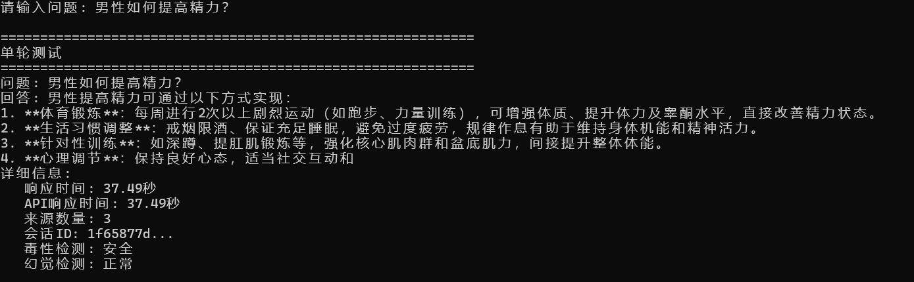
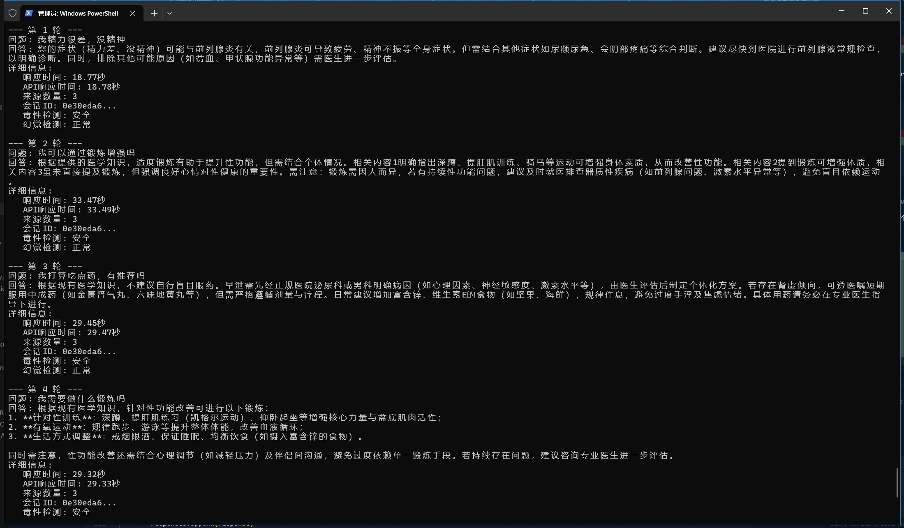

# Hybrid-RAG 混合检索增强生成系统

> 基于 **Qwen3-4B** 的企业级医疗问答系统

[](https://www.python.org/downloads/)
[](https://pytorch.org/)
[](https://fastapi.tiangolo.com/)
[](LICENSE)

[中文文档](README.md) | [English Documentation](README_EN.md)

## 项目概述

Hybrid-RAG是一个完整的企业级RAG系统，展示了从简单规则匹配到深度学习AI系统的完整技术演进过程。项目专注于医疗AI领域，实现了智能混合检索、多维度冲突检测、智能对话管理和双重安全检测等核心技术。

## 项目特色

- **企业级技术栈**: Qwen3-4B + BERT + Faiss + ElasticSearch + FastAPI
- **智能混合检索**: 语义+关键词双重检索
- **多维度冲突检测**: 医疗知识图谱验证
- **智能对话管理**: DST状态跟踪 + 实体识别，多轮对话
- **双重安全检测**: 幻觉检测 + 毒性检测，确保医疗AI安全
- **一键GPU部署**: Docker + CUDA加速，5分钟快速启动


## 技术栈

| 组件 | 技术选型 | 版本 | 作用 |
|------|----------|----|------|
| **LLM** | Qwen3-4B |  | 文本生成 |
| **向量检索** | Faiss + BERT | 1.7.4+ | 语义相似度匹配 |
| **文本检索** | ElasticSearch | 8.0+ | 关键词精确匹配 |
| **混合检索** | 自适应权重调整 | - | 语义+关键词智能融合 |
| **冲突检测** | 医疗知识图谱 | - | 多维度医疗信息验证 |
| **对话管理** | DST状态跟踪 | - | 多轮对话状态管理 |
| **安全检测** | 双重检测机制 | - | 幻觉+毒性双重过滤 |
| **毒性检测** | BERT模型/规则检测 | - | 医疗内容安全过滤 |
| **API框架** | FastAPI | 0.104+ | REST API服务 |

## 核心技术

### 1. 智能混合检索系统
- **双重检索机制**: BERT语义检索 + ElasticSearch关键词检索
- **自适应权重调整**: 根据查询类型动态调整检索权重


### 2. 企业级冲突检测
- **医疗知识图谱**: 结构化医疗知识验证
- **多维度检测**: 语义冲突 + 事实冲突 + 剂量冲突


### 3. 智能对话管理系统
- **DST状态跟踪**: 完整的对话状态机实现
- **实体识别**: 医疗实体同义词识别
- **上下文感知**: 多轮对话一致性

### 4. 双重安全检测机制
- **幻觉检测**: 基于语义相似度的多维度检测
- **毒性检测**: 医疗内容安全过滤
- **置信度评估**: 为每个回答提供可信度评分

## 快速开始

### 环境要求

- **Python**: 3.8+
- **Docker**: 最新版本
- **内存**: 12GB+ (推荐16GB)
- **显卡**: CUDA
- **ElasticSearch**: 8.0+

### Docker一键部署（docker部署成功后也要等到初始化，最好等个十几分钟）

**Windows PowerShell**:(看好了，看好了，是PowerShell)
```bash
# 1. 克隆项目
git clone https://github.com/EasonWong0327/Hybrid-RAG-System.git
cd Hybrid-RAG-System

# 2. 启动ElasticSearch
cd ES
docker-compose up -d

# 3. 一键部署RAG系统
cd ../QA/deployment

.\quick-deploy-gpu.ps1
```

**Linux/Mac**:
```bash
# 1. 克隆项目
git clone https://github.com/EasonWong0327/Hybrid-RAG-System.git
cd Hybrid-RAG-System

# 2. 启动ElasticSearch
cd ES
docker-compose up -d

# 3. 一键部署RAG系统
cd ../QA/deployment
chmod +x quick-deploy-gpu.sh
./quick-deploy-gpu.sh
```

完成后访问：
- **API文档**: http://localhost:8000/docs  
- **健康检查**: http://localhost:8000/health


### 测试示例（docker部署成功后也要等到初始化，最好等个十几分钟再测试）
```
cd tests

python quick_test.py

```
#### 单轮测试

#### 多轮测试



## 项目结构

```
Hybrid-RAG/
├── QA/                    # 核心RAG系统
│   ├── api/               # API接口层
│   │   └── rag_api.py     # RAG系统API接口
│   ├── config/            # 配置管理
│   │   └── config.py      # 系统配置文件
│   ├── core/              # 核心功能模块
│   │   ├── detectors/     # 检测器模块
│   │   │   ├── hallucination_detector.py  # 幻觉检测器
│   │   │   ├── toxicity_detector.py       # 毒性检测器
│   │   │   └── train_toxicity_detector.py # 训练脚本
│   │   ├── dialogue/      # 对话管理模块
│   │   │   ├── dialogue_manager.py        # 对话管理器
│   │   │   └── smart_dst.py               # 智能DST状态跟踪
│   │   ├── generators/    # 生成器模块
│   │   │   ├── bert_encoder.py            # BERT文本编码器
│   │   │   └── qwen3_generator.py         # Qwen3生成器
│   │   └── retrievers/    # 检索器模块
│   │       ├── es_retriever.py            # ElasticSearch检索器
│   │       ├── faiss_retriever.py         # Faiss向量检索器
│   │       └── adaptive_hybrid_retriever.py # 混合检索器
│   ├── deployment/        # 部署配置
│   │   ├── docker-compose.gpu.yml         # Docker compose配置
│   │   ├── Dockerfile.gpu                 # Docker镜像配置
│   │   ├── quick-deploy-gpu.ps1           # Windows部署脚本
│   │   └── quick-deploy-gpu.sh            # Linux部署脚本
│   ├── data/              # 医疗数据
│   ├── tests/             # 测试模块
│   ├── utils/             # 工具函数
│   └── main.py            # 主启动文件
├── ES/                    # ElasticSearch配置
└── README.md              # 项目文档
```

## 核心算法

### 1. 混合检索策略（自由or再加一个训练器动态调节）
```python
# 向量检索权重: 60%
vector_score = semantic_similarity * 0.6

# 文本检索权重: 40%  
text_score = keyword_match * 0.4

# 最终得分
final_score = vector_score + text_score
```

### 2. 对话状态跟踪
- **实体识别**: 提取医疗相关实体
- **意图理解**: 分析用户查询意图
- **上下文维护**: 保持多轮对话连贯性

### 3. 安全检测机制
- **毒性检测**: 过滤有害内容
- **幻觉检测**: 多维度检测生成内容的可靠性
- **内容审核**: 确保医疗回答的安全性
- **置信度评估**: 低置信度回答会被标记

## 配置详解

### 主要配置项
在 `QA/config/config.py` 中调整系统参数：

```python
# LLM配置
LLM_MODEL_NAME = "Qwen/Qwen3-4B"  # 模型名称
LLM_TEMPERATURE = 0.7             # 生成温度

# 检索配置
VECTOR_WEIGHT = 0.6               # 向量检索权重
TEXT_WEIGHT = 0.4                 # 文本检索权重
TOP_K = 5                         # 返回结果数量

# API配置
API_HOST = "0.0.0.0"              # 服务主机
API_PORT = 8000                   # 服务端口

# 对话配置
MAX_HISTORY_TURNS = 20            # 最大历史轮数
SESSION_TIMEOUT = 3600            # 会话超时(秒)
```

### 环境变量配置
创建 `.env` 文件：
```bash
# ElasticSearch配置
ES_HOST=localhost
ES_PORT=9200
ES_USERNAME=
ES_PASSWORD=

# LLM配置
LLM_MODEL_NAME=Qwen/Qwen3-4B
LLM_DEVICE=cuda
LLM_MAX_LENGTH=2048
LLM_TEMPERATURE=0.7

# 对话配置
MAX_HISTORY_TURNS=20
SESSION_TIMEOUT=3600
```


## 开源协议

本项目采用 [MIT License](LICENSE) 开源协议。

## 致谢

- 感谢 [Qwen团队](https://github.com/QwenLM/Qwen) 提供优秀的开源模型
- 感谢 [Hugging Face](https://huggingface.co/) 提供模型托管服务
- 感谢开源社区的所有贡献者

---

### 如果这个项目对你有帮助，请给个Star！

**技术栈**: Python + PyTorch + Transformers + Faiss + ElasticSearch + FastAPI  
**作者**: [ EasonWong ]  
**邮箱**: eason0912happy@gmail.com  
**项目地址**: https://github.com/EasonWong0327/Hybrid-RAG-System

[中文文档](README.md) | [English Documentation](README_EN.md)