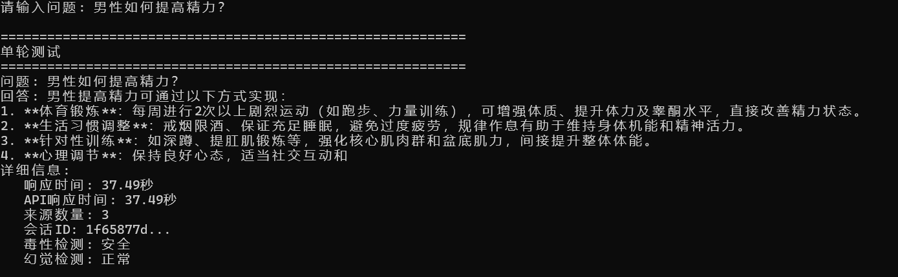

# Hybrid-RAG Hybrid Retrieval-Augmented Generation System

> Enterprise-level Medical Q&A System based on **Qwen3-4B**

[](https://www.python.org/downloads/)
[](https://pytorch.org/)
[](https://fastapi.tiangolo.com/)
[](LICENSE)

[中文文档](README.md) | [English Documentation](README_EN.md)

## Project Overview

Hybrid-RAG is a complete enterprise-level RAG system that demonstrates the full technical evolution process from simple rule matching to deep learning AI systems. The project focuses on the medical AI domain, implementing core technologies such as intelligent hybrid retrieval, multi-dimensional conflict detection, intelligent dialogue management, and dual security detection.

## Project Features

- **Enterprise Technology Stack**: Qwen3-4B + BERT + Faiss + ElasticSearch + FastAPI
- **Intelligent Hybrid Retrieval**: Semantic + Keyword dual retrieval
- **Multi-dimensional Conflict Detection**: Medical knowledge graph verification
- **Intelligent Dialogue Management**: DST state tracking + entity recognition, multi-turn dialogue
- **Dual Security Detection**: Hallucination detection + toxicity detection, ensuring medical AI safety
- **One-click GPU Deployment**: Docker + CUDA acceleration, 5-minute quick start

## Technology Stack

| Component | Technology | Version | Purpose |
|-----------|------------|---------|---------|
| **LLM** | Qwen3-4B |  | Text generation |
| **Vector Retrieval** | Faiss + BERT | 1.7.4+ | Semantic similarity matching |
| **Text Retrieval** | ElasticSearch | 8.0+ | Keyword exact matching |
| **Hybrid Retrieval** | Adaptive weight adjustment | - | Semantic + keyword intelligent fusion |
| **Conflict Detection** | Medical knowledge graph | - | Multi-dimensional medical information verification |
| **Dialogue Management** | DST state tracking | - | Multi-turn dialogue state management |
| **Security Detection** | Dual detection mechanism | - | Hallucination + toxicity dual filtering |
| **Toxicity Detection** | BERT model/rule detection | - | Medical content safety filtering |
| **API Framework** | FastAPI | 0.104+ | REST API service |

## Core Technologies

### 1. Intelligent Hybrid Retrieval System
- **Dual Retrieval Mechanism**: BERT semantic retrieval + ElasticSearch keyword retrieval
- **Adaptive Weight Adjustment**: Dynamically adjust retrieval weights based on query type

### 2. Enterprise-level Conflict Detection
- **Medical Knowledge Graph**: Structured medical knowledge verification
- **Multi-dimensional Detection**: Semantic conflict + factual conflict + dosage conflict

### 3. Intelligent Dialogue Management System
- **DST State Tracking**: Complete dialogue state machine implementation
- **Entity Recognition**: Medical entity synonym recognition
- **Context Awareness**: Multi-turn dialogue consistency

### 4. Dual Security Detection Mechanism
- **Hallucination Detection**: Multi-dimensional detection based on semantic similarity
- **Toxicity Detection**: Medical content safety filtering
- **Confidence Assessment**: Provide credibility scores for each answer

## Quick Start

### Requirements

- **Python**: 3.8+
- **Docker**: Latest version
- **Memory**: 12GB+ (16GB recommended)
- **GPU**: CUDA
- **ElasticSearch**: 8.0+

### Docker One-click Deployment (Wait for initialization after successful docker deployment, preferably wait 10-15 minutes)

**Windows PowerShell** (Note: This is PowerShell):
```bash
# 1. Clone the project
git clone https://github.com/EasonWong0327/Hybrid-RAG-System.git
cd Hybrid-RAG-System

# 2. Start ElasticSearch
cd ES
docker-compose up -d

# 3. One-click deploy RAG system
cd ../QA/deployment
.\quick-deploy-gpu.ps1
```

**Linux/Mac**:
```bash
# 1. Clone the project
git clone https://github.com/EasonWong0327/Hybrid-RAG-System.git
cd Hybrid-RAG-System

# 2. Start ElasticSearch
cd ES
docker-compose up -d

# 3. One-click deploy RAG system
cd ../QA/deployment
chmod +x quick-deploy-gpu.sh
./quick-deploy-gpu.sh
```

After completion, visit:
- **API Documentation**: http://localhost:8000/docs
- **Health Check**: http://localhost:8000/health

### Test Examples (Wait for initialization after successful docker deployment, preferably wait 10-15 minutes before testing)
```bash
cd tests
python quick_test.py
```

#### Single-turn Test


#### Multi-turn Test


## Project Structure

```
Hybrid-RAG/
├── QA/                    # Core RAG system
│   ├── api/               # API interface layer
│   │   └── rag_api.py     # RAG system API interface
│   ├── config/            # Configuration management
│   │   └── config.py      # System configuration file
│   ├── core/              # Core functional modules
│   │   ├── detectors/     # Detector modules
│   │   │   ├── hallucination_detector.py  # Hallucination detector
│   │   │   ├── toxicity_detector.py       # Toxicity detector
│   │   │   └── train_toxicity_detector.py # Training script
│   │   ├── dialogue/      # Dialogue management module
│   │   │   ├── dialogue_manager.py        # Dialogue manager
│   │   │   └── smart_dst.py               # Intelligent DST state tracking
│   │   ├── generators/    # Generator modules
│   │   │   ├── bert_encoder.py            # BERT text encoder
│   │   │   └── qwen3_generator.py         # Qwen3 generator
│   │   └── retrievers/    # Retriever modules
│   │       ├── es_retriever.py            # ElasticSearch retriever
│   │       ├── faiss_retriever.py         # Faiss vector retriever
│   │       └── adaptive_hybrid_retriever.py # Hybrid retriever
│   ├── deployment/        # Deployment configuration
│   │   ├── docker-compose.gpu.yml         # Docker compose configuration
│   │   ├── Dockerfile.gpu                 # Docker image configuration
│   │   ├── quick-deploy-gpu.ps1           # Windows deployment script
│   │   └── quick-deploy-gpu.sh            # Linux deployment script
│   ├── data/              # Medical data
│   ├── tests/             # Test modules
│   ├── utils/             # Utility functions
│   └── main.py            # Main startup file
├── ES/                    # ElasticSearch configuration
└── README.md              # Project documentation
```

## Core Algorithms

### 1. Hybrid Retrieval Strategy (Free or add another trainer for dynamic adjustment)
```python
# Vector retrieval weight: 60%
vector_score = semantic_similarity * 0.6

# Text retrieval weight: 40%
text_score = keyword_match * 0.4

# Final score
final_score = vector_score + text_score
```

### 2. Dialogue State Tracking
- **Entity Recognition**: Extract medical-related entities
- **Intent Understanding**: Analyze user query intent
- **Context Maintenance**: Maintain multi-turn dialogue coherence

### 3. Security Detection Mechanism
- **Toxicity Detection**: Filter harmful content
- **Hallucination Detection**: Multi-dimensional detection of generated content reliability
- **Content Review**: Ensure medical answer safety
- **Confidence Assessment**: Low confidence answers will be marked

## Configuration Details

### Main Configuration Items
Adjust system parameters in `QA/config/config.py`:

```python
# LLM configuration
LLM_MODEL_NAME = "Qwen/Qwen3-4B"  # Model name
LLM_TEMPERATURE = 0.7             # Generation temperature

# Retrieval configuration
VECTOR_WEIGHT = 0.6               # Vector retrieval weight
TEXT_WEIGHT = 0.4                 # Text retrieval weight
TOP_K = 5                         # Number of returned results

# API configuration
API_HOST = "0.0.0.0"              # Service host
API_PORT = 8000                   # Service port

# Dialogue configuration
MAX_HISTORY_TURNS = 20            # Maximum history turns
SESSION_TIMEOUT = 3600            # Session timeout (seconds)
```

### Environment Variable Configuration
Create `.env` file:
```bash
# ElasticSearch configuration
ES_HOST=localhost
ES_PORT=9200
ES_USERNAME=
ES_PASSWORD=

# LLM configuration
LLM_MODEL_NAME=Qwen/Qwen3-4B
LLM_DEVICE=cuda
LLM_MAX_LENGTH=2048
LLM_TEMPERATURE=0.7

# Dialogue configuration
MAX_HISTORY_TURNS=20
SESSION_TIMEOUT=3600
```

## License

This project is licensed under the [MIT License](LICENSE).

## Acknowledgments

- Thanks to the [Qwen team](https://github.com/QwenLM/Qwen) for providing excellent open-source models
- Thanks to [Hugging Face](https://huggingface.co/) for providing model hosting services
- Thanks to all contributors in the open-source community

---

### If this project helps you, please give it a Star!

**Technology Stack**: Python + PyTorch + Transformers + Faiss + ElasticSearch + FastAPI  
**Author**: [EasonWong]  
**Email**: eason0912happy@gmail.com  
**Project URL**: https://github.com/EasonWong0327/Hybrid-RAG-System

[中文文档](README.md) | [English Documentation](README_EN.md) 